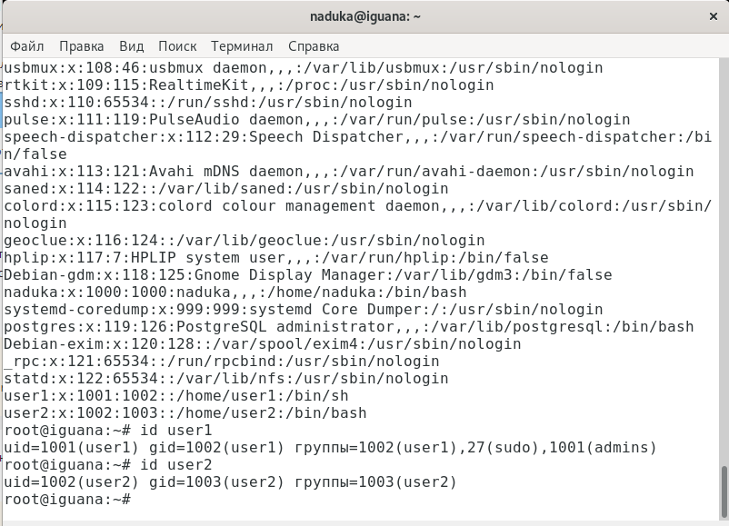

Laba-AAA.md

## Lab-AAA

**Создание пользователей**

UID user1 1001
UID user2 1002
Опция -s регистрационная оболочка пользователя.
Опция -m позволяет создать домашний каталог для пользователя.

**Создание группы и добавление в неё пользователей**

Добавление пользователей в группу, а затем указание основной группы (admins) для пользователя user1 и второстепенной для user2.

**Создание каталога и распределение прав**

С помощью команды chmod 770 даётся разрешение на взаимодействие с директорией и/или файлом. В данном случае, мы даём все права владельцу файла и группе, но не разрешаем ничего для остальных пользователей.

Созданные файлы в указанной директории.

У user1 указана основная группа admins, у user2 основная группы user2. Как только мы изменим группу user2 на admins у user2 и создадим новый файл, то уже будет указана группа admins.

**Создание user3 и выдача прав на написание в /opt/upload**

Создание пользователя user3. Получение ACL.

При попытке создать файл в директории /opt/upload с пользователя user3, появляется ошибка.

Добавление прав на запись в директорию из-под пользователя user3.

**Установка GUID флага на директорию /opt/upload**

Почему изменилась группа?

**Установка SUID флага на выполянемый файл**
При попытки прочитать файл /etc/shadow под пользователем user3 появляется ощибка "Отказано в доступе". Как только , то на экране выводится содержимое файла.

**Смена владельца директории /opt/upload на пользователя user3 и установка sticky-бит**

Файлы удаляются только владельцем директории или владельцем файла и никем больше. Владелец директории у нас user3. Владелец файла user1.

При попытке удалить файл, созданный user1, пользователем user1, операция успешно выполняется и никаких ошибок не возникает. Если зайти с пользователя user2 и удалить файл, созданный user1, то возникнет ошибка, так как user2 не является владельцем файла. Sticky-бит позволяет удалять файлы только непосредственно их владельцам. 

На скриншоте показано, как файл, созданный user2, не удаляется при вызове команды *rm -f /opt/upload/test2_1_1.sh* под пользователем user1.

**Запись в sudoers**

???

