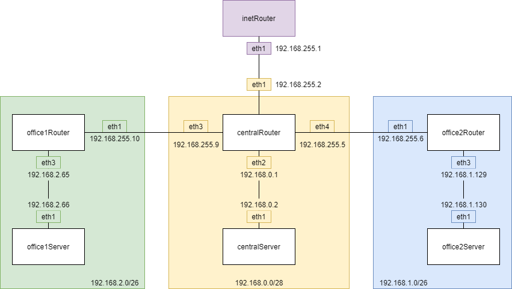
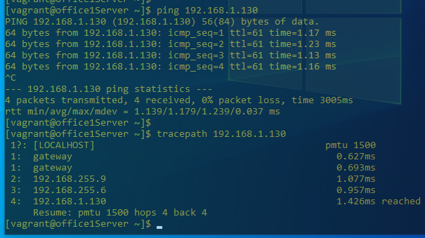
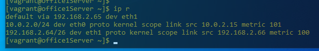
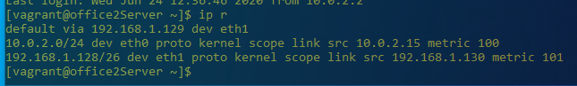
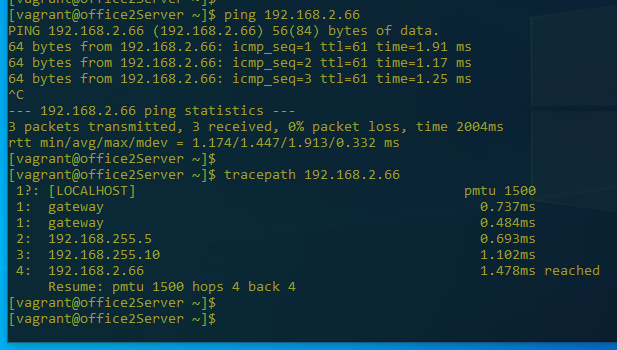
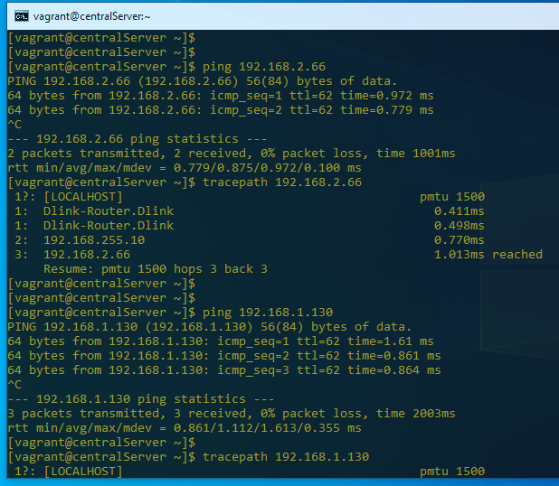
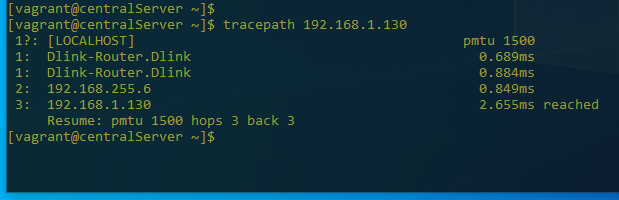

network

## Лабораторная работа #1
**Задание 1**

*Задание:*

- разобрать структуру приложенного Vagrantfile;
- нарисовать схему;
- расписать возможные подсети.

Схема сети:

**Задание 2**

- найти свободные подсети;
- подсчитать, сколько узлов в каждой подсети, включая свободные;
- указать broadcast-адрес для каждой подсети;
- проверить, нет ли ошибок при разбиении.

Подсети первой сети:

192.168.2.0/26, узлов: 62
broadcast: 192.168.2.63

192.168.2.64/26, узлов: 62
broadcast: 192.168.2.127

192.168.2.128/26, узлов: 62
broadcast: 192.168.2.191

Подсети второй сети:

192.168.1.0/25, узлов: 126
broadcast: 192.168.1.127

192.168.1.128/26, узлов: 62
broadcast: 192.168.1.191

192.168.1.192/26, узлов: 62
broadcast: 192.168.1.255

Подсети третьей сети:

192.168.0.0/28, узлов: 14
broadcast: 192.168.0.15

**Задание 3**

*Задание:*

- все серверы и роутеры должны ходить в Интернет черз inetRouter;
- все серверы должны видеть друг друга;
- у всех новых серверов отключить дефолт на NAT (eth0), который Vagrant поднимает для связи;
- в README приложить скриншоты tracepath и ip r.

office1Server -> office2Server

office2Server -> office1Server

centralServer -> office1Server && office2Server 

**Задание 4**

*Задание:*

- поднять nginx на officе2Server
- запретить office1Server ходить на office2Server на 80й порт, все остальные должны работать
- запретить office1Server отвечать на пинг, всем кроме inetRouter, но office1Server должен пинговать всех остальных

